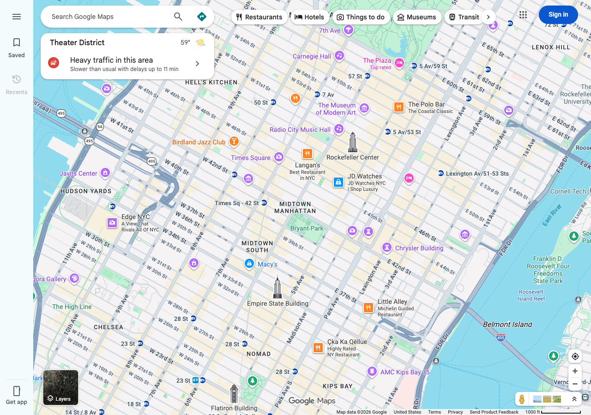
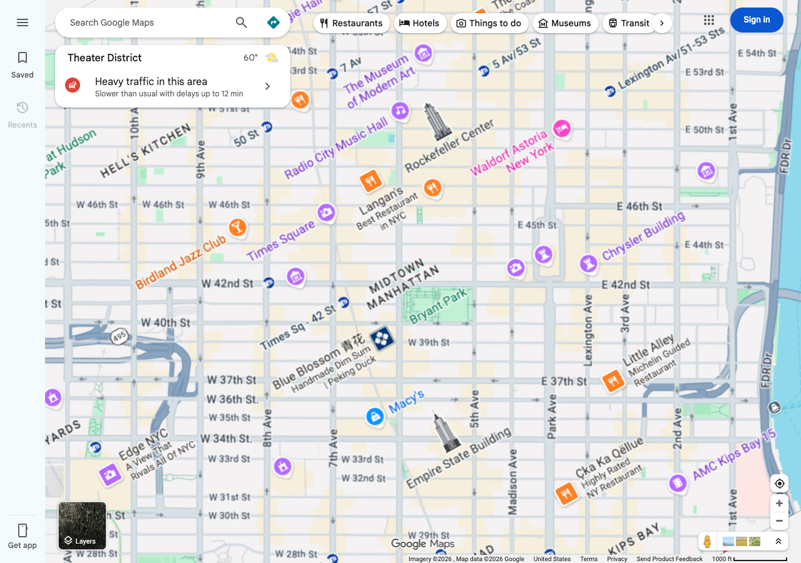

# Straighten NYC Grid

A tiny Chrome extension that rotates Google Maps so Manhattan's street grid runs straight up-and-down, the way the Commissioners' Plan of 1811 clearly intended before geography rudely intervened.

| Before (the lie) | After (the truth) |
| :---: | :---: |
|  |  |

## Installation (unpacked)

1. Unzip this folder somewhere you won't `rm -rf` by accident.
2. Open `chrome://extensions`.
3. Flip **Developer mode** on (top right) — yes, it's fine, you're a developer now.
4. Click **Load unpacked** → pick the folder.
5. Pin it from the puzzle-piece menu so you can find it again.

## Usage

1. Go to [google.com/maps](https://www.google.com/maps), navigate to anywhere in NYC.
2. Click the extension icon, toggle **Rotate map**.
3. Default angle is **-28.9°** (the actual tilt of Manhattan's grid; yes, someone measured it). Slider for fine-tuning, button for chickening out back to the default.

## "But does dragging still work?"

Yes. This was the part that took several hours to be honest about.

CSS `transform: rotate()` only moves pixels around — Google Maps still reads pointer-drag deltas in unrotated screen coordinates, so without intervention dragging "up" pans you diagonally like a drunk pigeon. The fix is in `page-world.js`: a content script declared with `"world": "MAIN"` in the manifest, which runs in the page's own JavaScript context (not the isolated content-script sandbox), intercepts pointer events in capture phase, and rewrites their `clientX/Y/pageX/Y/screenX/Y/movementX/Y` via `Object.defineProperty` so Maps sees deltas pre-rotated by the inverse angle and pre-divided by the cover-the-corners scale factor.

The events stay `isTrusted: true` — we never re-dispatch, just rewrite — which matters because Maps ignores synthetic events. (Discovered the hard way.)

## Known caveats, presented without apology

- **Tiles still load for the unrotated viewport.** The corners exposed by rotating + scaling-to-cover are loaded at lower detail. There's no fix that doesn't involve calling `Map.setHeading()`, which `maps.google.com` does not expose to mortals.
- **Two-finger gestures** (pinch-zoom, twist-rotate) are untested. Mouse drag and wheel-zoom are tested.
- **Clicks on canvas-drawn markers** could land on the wrong target if Maps does its own internal hit-testing on raw pointer coords. DOM-based markers are fine because the browser handles CSS-transform-aware hit-testing.
- **Class names are obfuscated and rotate with each Maps deploy.** The selector targets the stable `div[role="application"][aria-label^="Map"]` — if Google ever renames *that*, the function `findMapElement()` in `content.js` is the entire fix surface.

## Files, for the curious

- `manifest.json` — declares two content scripts: `content.js` (isolated world, owns the CSS rotation + storage) and `page-world.js` (main world, owns the pointer counter-rotation).
- `content.js` — finds the map element, applies/removes the CSS rotate+scale, mirrors state to `data-*` attributes on `<html>` so `page-world.js` can read it.
- `page-world.js` — the part that took all afternoon.
- `popup.html` / `popup.js` — toggle and slider.

## Why -28.9°

Because John Randel Jr. surveyed the island starting in 1808 and the resulting grid was tilted to roughly fit the long axis of Manhattan rather than true north, and ever since then everyone has had to mentally rotate maps in their head before giving directions. This extension is just doing what your brain was already doing, but better.
